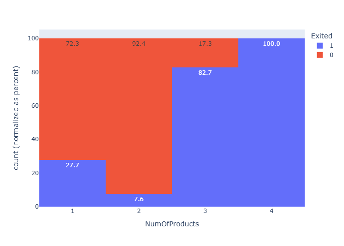
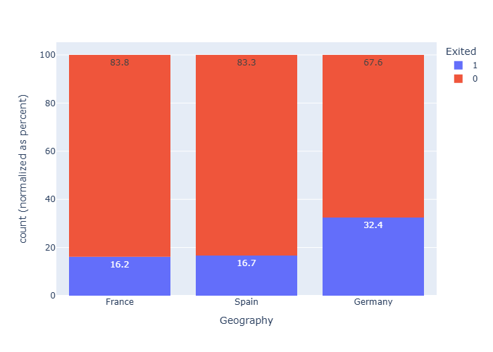
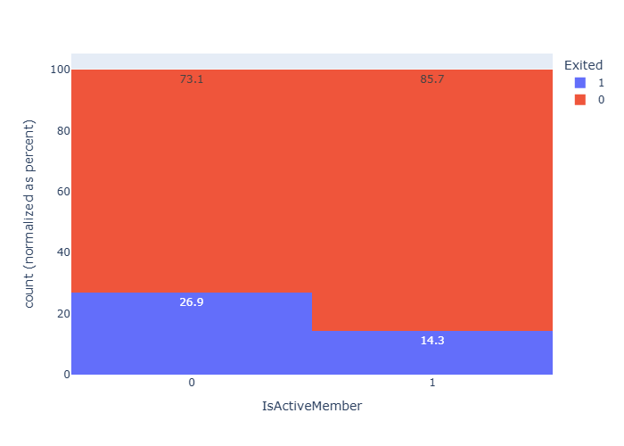
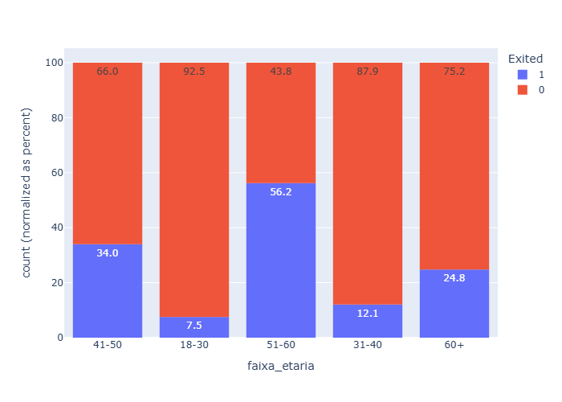

# Análise de Cancelamento de Clientes - Banco (EDA)

Análise exploratória de dados (EDA) sobre cancelamento de clientes de uma instituição bancária, identificando os principais fatores associados ao churn e propondo ações práticas de retenção com base em evidências.

## 🎯 O problema que o projeto resolve

O **Banco Nordic Crédito** (cenário fictício criado para este projeto), instituição financeira com operação em três países (França, Espanha e Alemanha), vem enfrentando uma taxa de cancelamento de clientes acima do esperado. Este projeto investiga a base de clientes para identificar quais características mais se relacionam ao cancelamento, com o objetivo de direcionar campanhas de retenção de forma mais assertiva.

## 🔍 Perguntas de negócio investigadas

- Existe uma faixa etária mais propensa a cancelar?
- Clientes com score de crédito mais baixo cancelam com mais frequência?
- A localização geográfica influencia a taxa de cancelamento?
- Clientes inativos têm maior probabilidade de cancelar?
- O número de produtos contratados impacta a fidelização?
- Ter cartão de crédito reduz as chances de cancelamento?

Além das perguntas iniciais, a análise avançou para cruzamentos entre variáveis (ex: faixa etária x geografia, geografia x saldo em conta) para investigar padrões que não ficaram claros na análise individual de cada coluna.

## 📊 Principais achados

- **Número de produtos contratados** é o fator mais forte identificado: clientes com 3 ou mais produtos cancelam entre 82,7% e 100% das vezes, contra apenas 7,6% entre quem tem 2 produtos.


- **Geografia**: clientes na Alemanha cancelam quase o dobro (32,4%) comparado a França e Espanha (~16%). A causa provável é estrutural, 0% das contas alemãs têm saldo zerado, contra ~48% em França e Espanha, e contas com saldo zerado são justamente as que menos cancelam.


- **Atividade do cliente**: clientes inativos cancelam quase o dobro (26,9%) comparado aos ativos (14,3%).


- **Faixa etária**: clientes entre 51-60 anos apresentam a maior taxa de cancelamento (56,2%), um padrão presente nos três países — a causa exata não foi identificada mesmo após testar outras variáveis como possível explicação.


- O cruzamento entre faixa etária e geografia revelou o segmento de maior risco: **clientes alemães entre 51-60 anos, com quase 70% de taxa de cancelamento.**

Score de crédito, cartão de crédito, tempo como cliente e salário estimado foram testados, mas não mostraram relação relevante com o cancelamento.

## 🛠️ Tecnologias utilizadas

- **Python 3**
- [`pandas`](https://pandas.pydata.org/) - manipulação e análise dos dados (utilizado na versão 3.0, com colunas de texto representadas como `str`)
- [`plotly`](https://plotly.com/python/) - visualização interativa dos dados
- [`Jupyter Notebook`](https://jupyter.org/) - ambiente de desenvolvimento da análise

## 📁 Estrutura do projeto

```
├── previsao_cancelamento_clientes.ipynb   # Notebook com a análise completa
├── Churn_Modelling.csv                     # Base de dados (Kaggle)
├── requirements.txt                         # Dependências do projeto
├── .gitignore
├── LICENSE
└── README.md
```

## ▶️ Como executar

1. Clone o repositório:
```bash
git clone https://github.com/gabrieloliveira-pro/analise-churn-bancario.git
cd analise-churn-bancario
```

2. Crie um ambiente virtual (opcional, mas recomendado):
```bash
python -m venv .venv
.venv\Scripts\Activate.ps1   # Windows
```

3. Instale as dependências:
```bash
pip install -r requirements.txt
```

4. Abra o notebook `previsao_cancelamento_clientes.ipynb` no VS Code ou Jupyter e execute as células em ordem.

## 📌 Metodologia

Cada variável analisada segue uma estrutura de **hipótese → conclusão**, testando suposições de negócio contra os dados reais, incluindo casos em que a hipótese não se confirmou, uma prática deliberada para manter o rigor da análise e evitar conclusões forçadas.

## 📌 Limitações e próximos passos

- A causa específica do pico de cancelamento na faixa 51-60 anos não foi identificada com as variáveis disponíveis no dataset. Produtos contratados e nível de atividade foram testados e descartados como explicação.
- Investigações futuras poderiam explorar dados adicionais, como motivo declarado de cancelamento ou histórico de atendimento ao cliente, não disponíveis nesta base.
- Uma evolução natural deste projeto seria treinar um modelo preditivo (classificação) para estimar a probabilidade de cancelamento de cada cliente individualmente.

## 📝 Licença

Este projeto está sob a licença especificada no arquivo [LICENSE](LICENSE).
